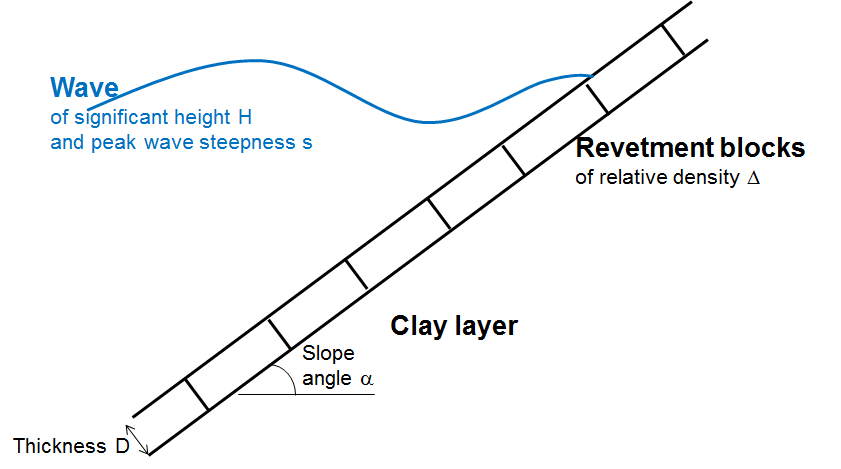
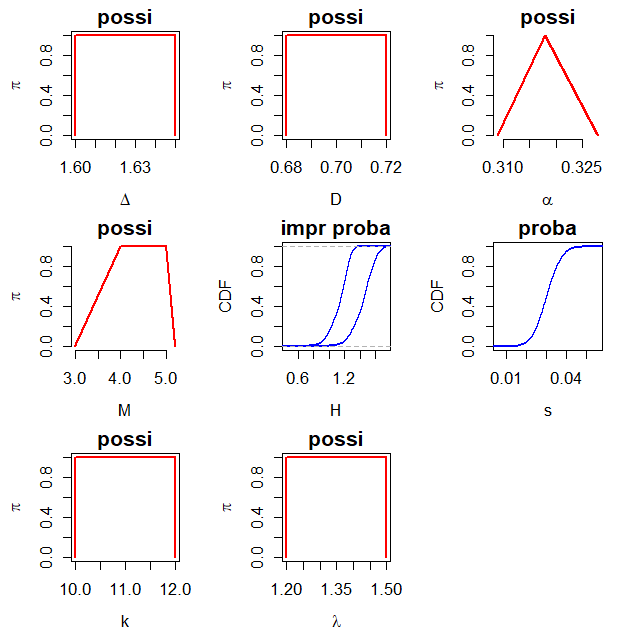
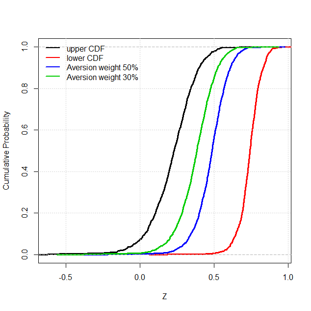
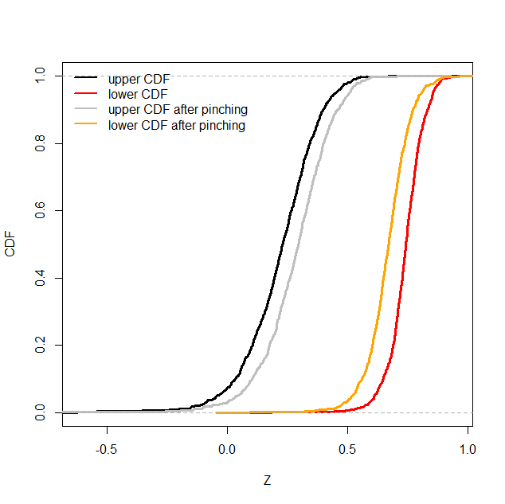

# HYRISK-vignette
This is the vignette of the R package [HYRISK](www) that is available on the CRAN. Click [here](https://rawcdn.githack.com/rohmerj/HYRISK-vignette/aaa78cc794e8cc0ff694f7d89356b7b532219d3a/hyrisk_demo.html) for html version, click [here](https://github.com/rohmerj/HYRISK-vignette/blob/main/hyrisk_demo.Rmd) for R Markdown, and click [here](https://github.com/rohmerj/HYRISK-vignette/blob/main/hyrisk_introduction.pdf) for PDF version.

```{r}
library(HYRISK)
```

## Description of the case

The case study is focused on the stability analysis of a dyke described by [Ferson and Tucker (2006)](https://doi.org/10.1016/j.ress.2005.11.052). The dyke has revetments made of masonry blocks subject to wave action as depicted schematically in the Figure below. The stability is estimated as the difference between the dike strength minus the stress acting on it as *Z = strength - stress* that is related to *Delta* the relative density of the revetment blocks, *D* their thickness, *alpha* the slope of the revetment, the wave characteristics, namely the significant wave height *H*, and the offshore peak wave steepness *s*. Finally an additional parameter is taken into account, i.e. the factor *M* reflects the risk analyst's vision on the uncertainty related to the model itself, i.e. its ability to reproduce reality. 

If Z>0, the dike is stable (the strength is greater than the stress); unstable otherwise. The study is focused on the estimate of the probability for *Z* to become negative, which is considered a measure of the dike reliability.



The assessment function is coded as follows:
```{r}
FUN<-function(X){
  delta=X[1]
  D=X[2]
  alpha=X[3]
  M=X[4]
  H=X[5]
  s=X[6]
return(delta*D-(H*tan(alpha)/(cos(alpha)*M*sqrt(s))))
}

```
## Step 1: uncertainty representation

The first step focuses on uncertainty representation. 
It aims at selecting the most appropriate mathematical tool to represent uncertainty on the considered parameter. 
The available options are: interval, possibility distribution (trapezoidal or triangular, see e.g. [Baudrit et al., 2006](https://doi.org/10.1016/j.csda.2006.02.009)), probability distribution (normal, lognormal, beta, triangle, uniform, Gumbel or user-defined), a probability distribution with imprecise parameters, i.e. a family of parametric probability distributions represented by a p-box; see e.g. [(Ferson et al. 2002)](https://www.osti.gov/servlets/purl/1427258). For the sake of clarity, we use the generic term imprecise probability to designate such a uncertainty representation tool. 
The procedure in *HYRISK* first uses the *CREATE_INPUT* function to define the input variables (imprecise, random or fixed); for instance by setting the values of the bounds of the interval, the mean and the standard deviation of a normal probability distribution, etc. Second, the *CREATE_DISTR* function assigns the corresponding distribution (probability or possibility) to each uncertain input. 


Parameter          | Symbol | Uncertainty type | Representation
-------------------|--------|------------------|-----------------
Significant wave height| $H$ | Randomness | p-box of type Weibull with imprecise shape and scale
Weibull scale         | *lambda* | Imprecision | Interval [1.2, 1.5]
Weibull shape          | *k* | Imprecision | Interval [10, 12 ]
Peak wave steepness          | *s* | Randomness | Normal (Gaussian) probability distribution with mean=0.040 and standard deviation=0.0055 
Revetment density          | *Delta* | Imprecision | Interval [1.60, 1.65] 
Revetment thickness         | *H* | Imprecision | Interval [0.68, 0.72]
Slope angle          | *lambda* | Imprecision | Triangular possibility distribution of support [0.309, 0.328] and core {0.318}
Expert-defined factor         | *M* | Imprecision | Trapezoidal possibility distribution of support [3, 5.2] and core [4, 5]

```{r}
#INPUT PARAMETERS
ninput<-8 
#Number of input parameters 
# input parameters for the model 
# + subvariables in case of a 2-level propagation
input<-vector(mode="list", length=ninput)

input[[1]]=CREATE_INPUT(
                        name=expression(Delta),
                        type="possi",distr="interval",param=c(1.6,1.65))
input[[2]]=CREATE_INPUT(
                        name="D",
                        type="possi",distr="interval",param=c(0.68,0.72))
input[[3]]=CREATE_INPUT(
                        name=expression(alpha),
                        type="possi",distr="triangle",
                        param=c(0.309,0.318,0.328))
input[[4]]=CREATE_INPUT(
                        name="M",
                        type="possi",distr="trapeze",param=c(3,4,5,5.2))
input[[5]]=CREATE_INPUT(
                        name="H",
                        type="impr proba",distr="user",param=c(7,8),
                        quser=qweibull,ruser=rweibull)
input[[6]]=CREATE_INPUT(
                        name="s",
                        type="proba",distr="normal",param=c(0.03,0.006))
input[[7]]=CREATE_INPUT(
                        name="k",
                        type="possi",distr="interval",param=c(10,12))
input[[8]]=CREATE_INPUT(
                        name=expression(lambda),
                        type="possi",distr="interval",param=c(1.2,1.5))

#CREATION OF THE DISTRIBUTIONS ASSOCIATED TO THE PARAMETERS
input=CREATE_DISTR(input)
```
A visualisation function *PLOT_INPUT* has also been implemented to handle the different representation forms. 
```{r}
#VISUALISATION of INPUT UNCERTAINTY REPRESENTATION
PLOT_INPUT(input)
```


## Step 2: uncertainty propagation

The second step aims at conducting uncertainty propagation, i.e. evaluating the impact of the uncertainty pervading the input on the outcome of the risk assessment model. To do so, the main function is *PROPAG*, which implements the Monte-Carlo-based algorithm of [Baudrit et al. 2007](https://doi.org/10.1016/j.ijar.2006.07.001), named *IRS* (Independent Random Sampling), for jointly handling possibility and probability distributions and the algorithm of [Baudrit et al. 2008](https://doi.org/10.1016/j.fss.2008.02.013) for jointly handling possibility, probability distributions and p-boxes. 

### IRS
```{r}
#OPTIMZATION CHOICES
choice_opt="L-BFGS-B_MULTI" ## quasiNewton with multistart
param_opt=10 ## 10 multistarts

#PROPAGATION RUN
Z0_IRS<-PROPAG(N=1000,input,FUN,choice_opt,param_opt,mode="IRS")
```

### Post-processing of the Results

The output of the propagation procedure can be summarized in the form of a pair of upper and lower cumulative probability distributions (CDFs), in the form of a p-box as proposed by [Baudrit et al. 2007](https://doi.org/10.1016/j.ijar.2006.07.001). The following code provides the output of the propagation phase using the *PLOT_CDF* function.
In some situations, the analysts may be more comfortable in deriving a unique probability distribution. 
In order to support decision-making with a less extreme indicator than using either probability bounds, 
[Dubois and Guyonnet (2011)](https://doi.org/10.1080/03081079.2010.506179) proposed to weight the bounds by an index *w*, which reflects the attitude of the decision-maker to risk (i.e. the degree of risk aversion). This can be done using the *SUMMARY_1CDF* function as follows using two aversion weight values of respectively 30 and 50%.

```{r}
#Visualisation
PLOT_CDF(Z0_IRS,xlab="Z",ylab="Cumulative Probability",main="",lwd=3.5)
grid(lwd=1.5)
#Summary with one CDF
Z50<-SUMMARY_1CDF(Z0_IRS,aversion=0.5)##risk aversion of 50%
lines(ecdf(Z50),col=4,lwd=3.5)
Z30<-SUMMARY_1CDF(Z0_IRS,aversion=0.3)##risk aversion of 30%
lines(ecdf(Z30),col=3,lwd=3.5)
legend("topleft",c("upper CDF","lower CDF","Aversion weight 50%",
"Aversion weight 30%"),col=c(1,2,4,3),lwd=2.5,bty="n")
```


The functionalities of *HYRISK* enable to summarise the p-box depending on the statistical quantity of interest supporting the decision making process. 

*	If the interest is a quantile at a given level (say 75%), the *QUAN_INTERVAL* function provides the corresponding interval.
```{r}
#Interval of quantiles
level=0.75##quantile level
quant<-QUAN_INTERVAL(Z0_IRS,level)
print(paste("Quantile inf: ",round(quant$Qlow,2)))
print(paste("Quantile sup: ",round(quant$Qupp,2)))
```

*	If the interest is a global measure of epistemic uncertainty affecting the whole probability distribution of *Z*, the *UNCERTAINTY* function computes the area within the lower and upper probability distribution.
```{r}
#Global indicator of uncertainty
unc<-UNCERTAINTY(Z0_IRS)
print(paste("Epistemic uncertainty : ",round(unc,2),sep=""))
```

* If the interest is the probability of Z being below the decision threshold at zero, the *PROBA_INTERVAL* function provides the corresponding upper and lower bound on this probability.

```{r}
#Interval of probabilities
thres=0.## decision threshold
prob<-PROBA_INTERVAL(Z0_IRS,thres)
print(paste("Probability inf: ",round(prob$Plow,2)))
print(paste("Probability sup: ",round(prob$Pupp,2)))
```


## Step 4: sensitivity analysis

The last step focuses on sensitivity analysis. The approach, based on the pinching method of [Ferson and Tucker (2006)](https://doi.org/10.1016/j.ress.2005.11.052), is implemented using the *PINCHING_fun* and *SENSI_PINCHING* functions. In the following, we analyse the sensitivity to the 8th input parameter.

```{r}
#################################################
#### PINCHING - scale
#################################################
Z0p<-PINCHING_fun(
	which=8,##scale parameter
	value=1.4, ##pinched at the scalar value of 1.4
	N=1000,
	input,
	FUN,
	choice_opt,
	param_opt,
	mode="IRS"
	)
```

```{r}
#VISU - PROPAGATION
PLOT_CDF(Z0_IRS,xlab="Z",ylab="CDF",main="",lwd=3.5)
PLOT_CDF(Z0p,color1="gray75",color2="orange",new=FALSE,lwd=3.5)
legend("topleft",c("upper CDF","lower CDF","upper CDF after pinching",
"lower CDF after pinching"),col=c(1,2,"gray75","orange"),lwd=2.5,bty="n")
```


After pinching, the impact of the epistemic reduction can be summarised using the *SENSI_PINCHING* function in terms of:
*	Reduction of the area between both CDFs.
*	Reduction of the interval of probability of exceeding the zero threshold.
*	Reduction of the interval of quantile, for instance at 75%.

```{r}
# quantile mode
sensi.quan<-SENSI_PINCHING(Z0_IRS,Z0p,mode="quantile",level=0.75)
print(paste("Quantile-based sensitivity measure: ",round(sensi.quan,2),sep=""))

# proba mode
sensi.proba<-SENSI_PINCHING(Z0_IRS,Z0p,mode="proba",threshold=0)
print(paste("Proba-based sensitivity measure: ",round(sensi.proba,2),sep=""))

# global mode
sensi.global<-SENSI_PINCHING(Z0_IRS,Z0p,mode="global",disc=0.01)
print(paste("global sensitivity measure: ",round(sensi.global,2),sep=""))
```


